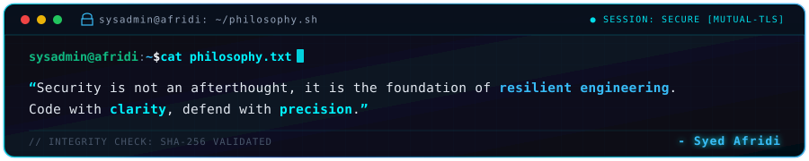
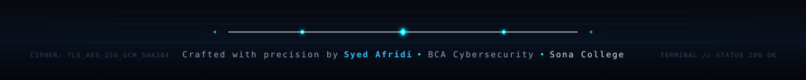

  

  

  
  
  
  

  

<h2 align="center">About Me</h2>

  

  

  Hey! I'm <b>Syed Afridi</b>, a <b>BCA Cybersecurity student & full-stack developer</b> at <b>Sona College of Arts and Science</b>. 
  I specialize in system security, offensive and defensive security concepts, and architecting resilient full-stack web solutions. 
  Passionate about exploring low-level system internals, hardening Linux environments with Docker, and building high-performance web platforms.

  
  
  

  <b>Let's Discuss:</b> Python, C, JavaScript, System Security, Web Vulnerabilities, React, Docker &amp; Linux Internals. 
  <b>Philosophy:</b> <i>"Turning code into defense &mdash; engineering scalable systems that stand strong under scrutiny."</i>

<table width="100%" border="0" align="center">
  <tr>
    <td width="50%" align="center" style="padding: 14px;">
      <h4>Flagship Project</h4>
      

        <a href="https://edgyn.in" target="_blank"><b>Edgyn</b></a> 
        Modern Web Platform &amp; Scalable Architecture
      

    </td>
    <td width="50%" align="center" style="padding: 14px;">
      <h4>Active Deep Dives</h4>
      

        <b>System Security &amp; Linux Internals</b> 
        Defensive Architecture &amp; Vulnerability Research
      

    </td>
  </tr>
  <tr>
    <td width="50%" align="center" style="padding: 14px;">
      <h4>Full-Stack Focus</h4>
      

        <b>React, Next.js &amp; Node.js</b> 
        High-Performance End-to-End Applications
      

    </td>
    <td width="50%" align="center" style="padding: 14px;">
      <h4>Collaboration</h4>
      

        <b>Cybersecurity &amp; Web Projects</b> 
        Open to innovative initiatives &amp; research
      

    </td>
  </tr>
</table>

<h2 align="center">Featured Project Spotlight</h2>

<table width="100%" border="0" align="center">
  <tr>
    <td align="center" style="padding: 22px;">
      <h3>Edgyn</h3>
      
<i>A cutting-edge modern web platform engineered for speed, clean user experience, and high scalability across modern web environments.</i>

       
      

        
        
      

    </td>
  </tr>
</table>

<h2 align="center">LeetCode Problem Solving</h2>

  <i>Live real-time tracker of algorithmic milestones, data structures, and problem-solving progress.</i>

  

  
  

<h2 align="center">Tech Stack &amp; Skills</h2>

<b>Core Programming Languages</b>

  

<b>Modern Web &amp; Backend</b>

  

<b>Tools, DevOps &amp; Security Environments</b>

  

  
  
  

<h2 align="center">GitHub Analytics &amp; Activity</h2>

  
  

  

  

<h2 align="center">Contribution Journey</h2>

  

<h2 align="center">Let's Connect &amp; Collaborate</h2>

  <i>Whether you want to discuss system security, web development, open-source initiatives, or explore collaboration &mdash; feel free to reach out!</i>

<table border="0" align="center">
  <tr>
    <td align="center" width="220" style="padding: 16px;">
      <a href="https://www.linkedin.com/in/syed-afridi-184507/" target="_blank">
          
        
      </a> 
      <b>Professional Network</b>
    </td>
    <td align="center" width="220" style="padding: 16px;">
      <a href="mailto:afridi.gd.18@gmail.com">
          
        
      </a> 
      <b>Direct Communication</b>
    </td>
    <td align="center" width="220" style="padding: 16px;">
      <a href="https://leetcode.com/u/Syed_Afridi_18/" target="_blank">
          
        
      </a> 
      <b>Algorithmic Challenges</b>
    </td>
  </tr>
</table>

  

