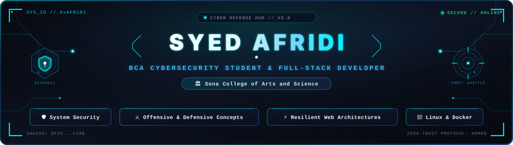

<div align="center">

  <!-- Header Banner -->
  

  <br />

  <!-- Dynamic Typing Tagline -->
  <a href="https://github.com/Syed-afridi-7">
    
  </a>

  <br /><br />

  <!-- Quick Social Badges -->
  <a href="https://www.linkedin.com/in/syed-afridi-184507id/" target="_blank">
    
  </a>
  &nbsp;
  <a href="https://leetcode.com/u/Syed_Afridi_18/" target="_blank">
    
  </a>
  &nbsp;
  <a href="mailto:afridi.gd.18@gmail.com">
    
  </a>
  &nbsp;
  <a href="https://nullvoidcodez.tutyafridi216.workers.dev/" target="_blank">
    
  </a>
  &nbsp;
  

</div>

---

### 👤 About Me

I am a **BCA (Cybersecurity)** student at **Sona College of Arts and Science**, driven by a strong problem-solving mindset and a passion for engineering practical, reliable software. 

Currently, I work as a **Software Developer Intern at Sona Incubation Foundation**, where I help architect scalable internal systems, alongside taking on independent freelance client projects. I thrive at the intersection of clean application code, Linux systems, and security-first development practices.

- 💼 **Current Role:** Software Developer Intern @ Sona Incubation Foundation & Freelancer
- 🎯 **Primary Interests:** Core Software Development, System Security & Scripting, Scalable Web Platforms
- 🧠 **Key Strengths:** Algorithmic Aptitude, Linux Systems Administration, Fast Prototyping
- ⚡ **Philosophy:** *"Write clean, reason clearly, and engineer systems that stay resilient under load."*

---

### 🚀 Featured Production Projects

<table>
  <tr>
    <td width="50%" valign="top">
      <h3 align="center">🏛️ Edgyy</h3>
      <p align="center"><b>The Operating System for Modern Startup Incubators</b></p>
      <p align="justify">
        Engineered during my internship at <b>Sona Incubation Foundation</b>. Edgyy is a comprehensive SaaS management platform built to streamline incubator operations: managing resident startups, tracking cohort KPIs, mentor assignments, funding rounds, and student internships.
      </p>
      <p align="center">
        <code>SaaS Architecture</code> &bull; <code>Dashboard UI</code> &bull; <code>Incubator Ops</code>
      </p>
      <p align="center">
        <a href="https://edgyy.in" target="_blank">
          
        </a>
      </p>
    </td>
    <td width="50%" valign="top">
      <h3 align="center">🛍️ AXYE Store</h3>
      <p align="center"><b>Luxury Men's & Women's Accessories E-Commerce</b></p>
      <p align="justify">
        A freelance client production build designed for modern luxury retail. Features a responsive, high-aesthetic storefront showcasing premium curated accessories with seamless navigation, optimized catalog browsing, and conversion-focused checkout flow.
      </p>
      <p align="center">
        <code>E-Commerce</code> &bull; <code>Frontend Design</code> &bull; <code>Client Delivery</code>
      </p>
      <p align="center">
        <a href="https://axyestore.in" target="_blank">
          
        </a>
      </p>
    </td>
  </tr>
</table>

---

### 🛠️ Tech Stack & Toolkit

```
Languages & Core    ──  Python  ──  C  ──  Java  ──  JavaScript  ──  HTML5 / CSS3
OS & Infrastructure ──  Linux   ──  Bash ── Git  ──  GitHub      ──  Docker (Basics)
Frontend & Design   ──  Responsive Web  ── Tailwind CSS ── Modern UI Components
AI & Accelerated Dev──  Cursor  ──  ChatGPT  ── GitHub Copilot ── Prompt Engineering
```

<br />

<div align="center">

| Domain | Technologies & Environments |
| :--- | :--- |
| **Core Languages** |     |
| **Environments & Tools** |     |
| **Frontend & UI** |    |
| **AI-Assisted Workflow** |  |

</div>

---

### 🔭 Current Focus & Learning Journey

- 🧩 **Data Structures & Problem Solving:** Actively practicing daily patterns on LeetCode to sharpen algorithmic intuition and time complexity optimization.
- 🛡️ **Defensive Security & Network Fundamentals:** Exploring core concepts in system hardening, safe memory patterns, and web security.
- ⚙️ **End-to-End Engineering:** Expanding my full-stack capabilities with real-world database design and backend services.

---

### 📊 GitHub Activity & Analytics

<div align="center">
  <table border="0">
    <tr>
      <td align="center">
        
      </td>
      <td align="center">
        
      </td>
    </tr>
  </table>

  <br />

  

  <br /><br />

  <!-- Animated Contribution Snake -->
  
</div>

---

### 💡 LeetCode Problem Solving

<div align="center">
  <p><i>Consistent algorithmic practice and problem-solving milestones.</i></p>
  
  <a href="https://leetcode.com/u/Syed_Afridi_18/" target="_blank">
    
  </a>
  
  <br /><br />
  
  <a href="https://leetcode.com/u/Syed_Afridi_18/" target="_blank">
    
  </a>
</div>

---

### 📜 Certifications & Achievements

<!-- Expandable section for verified milestones & certifications -->
<details open>
  <summary><b>Academic & Professional Milestones</b></summary>
  <br />
  <ul>
    <li>🏛️ <b>Software Developer Intern</b> &mdash; Sona Incubation Foundation (Active)</li>
    <li>🎓 <b>BCA (Cybersecurity)</b> &mdash; Sona College of Arts and Science (Pursuing)</li>
    <li>🛍️ <b>Commercial Freelance Delivery</b> &mdash; AXYE Store E-Commerce Platform</li>
    <li><i>(Upcoming professional certifications & security credentials will be listed here)</i></li>
  </ul>
</details>

---

### 🤝 Let's Connect

Whether you're looking to discuss **software development, incubator tooling, freelance projects**, or open-source collaboration, my inbox is always open.

<div align="center">
  <a href="https://www.linkedin.com/in/syed-afridi-184507id/" target="_blank">
    
  </a>
  &nbsp;&nbsp;
  <a href="mailto:afridi.gd.18@gmail.com">
    
  </a>
  &nbsp;&nbsp;
  <a href="https://nullvoidcodez.tutyafridi216.workers.dev/" target="_blank">
    
  </a>
</div>

<br />

<div align="center">
  <sub>Crafted with care by <b>Syed Afridi</b> &bull; Built with clean Markdown &amp; GitHub Actions</sub>
</div>
